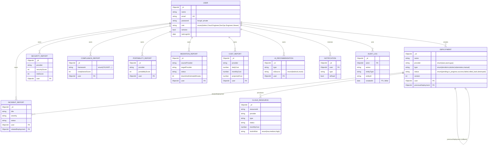

# Phase 3 — Database Design

**Datastore:** MongoDB Atlas (M0 free tier) / local MongoDB · **ODM:** Mongoose 8

This document describes the production database architecture: collections,
schemas, relationships, indexing strategy, and the cross-cutting concerns
(validation, soft delete, pagination, audit, RBAC ownership).

---

## 1. Design Principles

| Principle | Implementation |
|-----------|----------------|
| **Single source of truth for enums** | All enums live in `config/constants.js`; schemas import them so DB constraints and business logic never drift. |
| **Cross-cutting concerns as plugins** | `toJSON`, `softDelete`, and `paginate` are Mongoose plugins applied via a `createSchema()` helper. |
| **Audit & ownership everywhere** | Every domain doc has `createdBy`, `updatedBy`, `ownerRole` + `timestamps` (`createdAt`/`updatedAt`). |
| **Non-destructive deletes** | Soft delete (`isDeleted`, `deletedAt`, `deletedBy`); queries auto-exclude deleted docs. |
| **Repository pattern** | Services never touch Mongoose directly — they go through `BaseRepository`/specialized repositories. |
| **Index for access patterns** | Compound indexes match real query/sort/filter patterns (history, trends, scoring). |
| **Immutability where it matters** | `audit_logs` is append-only with a TTL retention policy. |

---

## 2. Collections (12)

| Collection | Model | Purpose |
|-----------|-------|---------|
| `users` | `User` | Identity, credentials (bcrypt), RBAC role, preferences |
| `deployments` | `Deployment` | Deployment actions, status, versions, rollback links |
| `cloud_resources` | `CloudResource` | Inventory across AWS/Azure/GCP; cost + lock-in hints |
| `security_reports` | `SecurityReport` | Scanner & adversarial-lab findings + scores |
| `compliance_reports` | `ComplianceReport` | CIS/NIST/etc. control results + score |
| `portability_reports` | `PortabilityReport` | Vendor lock-in analysis + portability score |
| `migration_reports` | `MigrationReport` | Cross-cloud migration plan, cost, risk, downtime |
| `incident_reports` | `IncidentReport` | AI root-cause analysis + lifecycle |
| `cost_reports` | `CostReport` | FinOps daily/monthly/projected + savings |
| `ai_recommendations` | `AIRecommendation` | Persisted Bedrock/Claude (or mock) outputs |
| `audit_logs` | `AuditLog` | Append-only security trail (TTL 365d) |
| `notifications` | `Notification` | In-app user notifications |

---

## 3. ER Diagram



> Relationships are modeled with `ObjectId` references (normalized). Embedded
> sub-documents are used for tightly-coupled, bounded lists (e.g. security
> `findings`, compliance `controls`, migration `plan` steps, cost `breakdown`).

---

## 4. Cross-cutting Fields

Applied to every domain document via `createSchema()`:

| Field | Type | Notes |
|-------|------|-------|
| `createdAt` / `updatedAt` | Date | Mongoose `timestamps` |
| `createdBy` / `updatedBy` | ObjectId → User | Audit trail |
| `ownerRole` | enum(role) | Role-based ownership / filtering |
| `isDeleted` | Boolean (indexed) | Soft delete flag |
| `deletedAt` / `deletedBy` | Date / ObjectId | Soft delete metadata |

`audit_logs` opts out (append-only) and `users` opt out of ownership fields.

---

## 5. Indexing Strategy

| Collection | Index | Why |
|-----------|-------|-----|
| users | `{ email: 1 }` unique | Login / uniqueness |
| users | `{ role: 1, isActive: 1 }` | Admin user management |
| deployments | `{ provider, status, createdAt:-1 }` | History filters + sort |
| deployments | `{ user, createdAt:-1 }` | "My deployments" |
| deployments | `{ name: 'text' }` | History search (Module 15) |
| cloud_resources | `{ provider, region, resourceId }` unique | Idempotent sync |
| cloud_resources | `{ provider, type, status }` | Dashboard counts |
| security_reports | `{ provider, createdAt:-1 }`, `{ riskScore:-1 }` | Latest scan, top risk |
| compliance_reports | `{ provider, framework, createdAt:-1 }` | Latest by framework |
| cost_reports | `{ provider, 'period.date':-1 }` | FinOps time series |
| incident_reports | `{ severity, status, createdAt:-1 }` | Triage views |
| audit_logs | `{ createdAt:1 }` TTL 365d | Retention policy |
| notifications | `{ user, isRead, createdAt:-1 }` | Unread badge |
| *(all)* | `{ isDeleted: 1 }` | Soft-delete filtering |

In non-production, `autoIndex` is on for convenience; in production it is
disabled and indexes should be built explicitly (e.g. via a migration job).

---

## 6. Pagination

Every model gains a static `paginate(filter, options)` (via the paginate plugin):

```js
const { results, page, limit, totalResults, totalPages, hasNextPage, hasPrevPage }
  = await Deployment.paginate({ provider: 'aws' }, { page: 2, limit: 20, sort: '-createdAt' });
```

`limit` is capped at `PAGINATION.MAX_LIMIT` (100) to protect the database.

---

## 7. Repository Layer

```
repositories/
├── BaseRepository.js          # generic CRUD + paginate + soft delete
├── UserRepository.js          # findByEmail(+password), recordLogin, byRole
├── DeploymentRepository.js    # history(search/filter), trends, latestSuccessful
├── AuditLogRepository.js      # append-only record() (never throws)
└── index.js                   # wires BaseRepository instances for the rest
```

Services depend on repositories, not on Mongoose — this keeps persistence
swappable and unit-testable.

---

## 8. Seed Data (Recruiter Demo Mode)

`src/seed/seed.js` + `src/seed/sampleData.js` insert a realistic dataset:

- 4 users — one per role (Admin / Cloud Engineer / DevOps Engineer / Viewer)
- Deployments across AWS, Azure, GCP (success / failed / in-progress)
- Cloud resources with lock-in hints
- Security, compliance, portability, migration, incident, cost reports
- An AI architecture recommendation + notifications

```bash
cd backend
npm install
npm run seed         # idempotent (skips if users exist)
npm run seed:fresh   # wipe + reseed (blocked in production)
```

**Demo credentials**

| Role | Email | Password |
|------|-------|----------|
| Admin | admin@demo.io | Admin@12345 |
| Cloud Engineer | cloud@demo.io | Cloud@12345 |
| DevOps Engineer | devops@demo.io | Devops@12345 |
| Viewer | viewer@demo.io | Viewer@12345 |

> Demo passwords are intentionally simple and for local use only. Never reuse them in any real environment.

---

## 9. Validation Highlights

- **Email**: regex + lowercase + unique.
- **Password**: min length 8; hashed with bcrypt (salt rounds from env); never serialized (`private`).
- **Enums**: provider, status, type, severity, framework, role — all enforced at the schema level.
- **Numeric bounds**: scores `0–100`, costs/`durationMs` `>= 0`.
- **Business rules**: migration `sourceProvider !== targetProvider`; scores auto-computed in pre-save hooks (security/compliance/cost).
