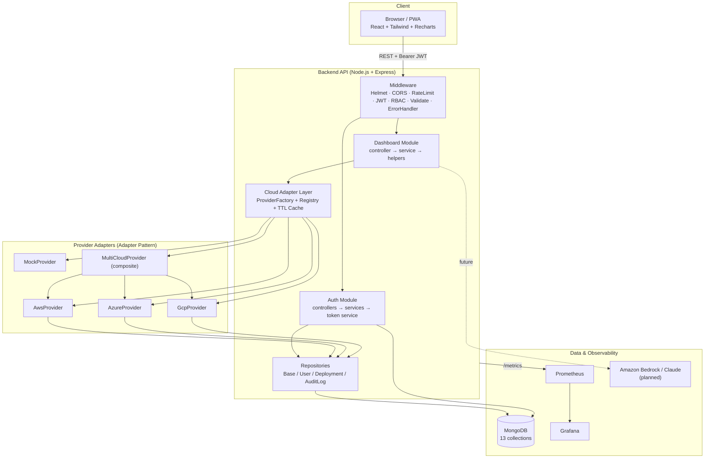

# Project Summary — AI-Powered Multi-Cloud Portability & Deployment Automation Platform

**Repository:** `Cloud-portaibility-app`
**Active branch:** `feature/platform-rebuild`
**Status:** Foundation complete (Phases 1–5 + Modules 2–3). AI and advanced ops modules pending.

A unified, free-tier-friendly control plane to deploy, monitor, secure, and
manage applications across **AWS, Azure, and GCP**, with a built-in **Demo Mode**
so the platform is fully functional with zero cloud accounts.

---

## 1. Folder Structure

```
Cloud-portaibility-app/
├── backend/                         # Node.js + Express API (ESM)
│   ├── src/
│   │   ├── app.js                   # Express app assembly (security, routes, errors)
│   │   ├── index.js                 # Entry: env validate → DB connect → listen
│   │   ├── config/                  # env.js, db.js, constants.js
│   │   ├── routes/                  # index, auth.routes, dashboard.routes
│   │   ├── controllers/             # auth.controller, dashboard.controller
│   │   ├── services/                # auth, token, dashboard, dashboard.helpers
│   │   ├── repositories/            # BaseRepository + User/Deployment/AuditLog + index
│   │   ├── models/                  # 13 Mongoose models + plugins/ + baseSchema
│   │   ├── middleware/              # auth, rbac, validate, rateLimit, errorHandler
│   │   ├── validations/             # auth.validation, dashboard.validation
│   │   ├── cloud-adapters/          # Adapter Pattern (Module 3)
│   │   │   ├── CloudProvider.js      #   abstract interface
│   │   │   ├── DbCloudProvider.js    #   DB-backed base
│   │   │   ├── aws/ azure/ gcp/      #   per-provider adapters
│   │   │   ├── mock/MockProvider.js  #   synthetic data
│   │   │   ├── MultiCloudProvider.js #   composite
│   │   │   ├── ProviderFactory.js    #   registry + scope resolution
│   │   │   └── cache.js              #   TTL cache
│   │   ├── ai/                       # (placeholder — AI modules pending)
│   │   ├── seed/                    # seed.js + sampleData.js (demo data)
│   │   └── utils/                   # logger, ApiError, asyncHandler, jwt, response
│   ├── tests/                       # unit/ + integration/ (jest + supertest)
│   ├── Dockerfile, jest.config.js, .eslintrc.json, .env.example, package.json
│
├── frontend/                        # React 18 + Vite PWA
│   ├── src/
│   │   ├── main.jsx, App.jsx, index.css
│   │   ├── config/                  # roles.js, navigation.js (role-based nav)
│   │   ├── context/                 # AuthContext, ThemeContext, NotificationContext
│   │   ├── hooks/                   # useAuth, useTheme, useNotification, useApi
│   │   ├── services/                # api (axios+JWT refresh), auth, dashboard
│   │   ├── routes/                  # ProtectedRoute, PublicOnlyRoute
│   │   ├── components/
│   │   │   ├── ui/                  # StatCard, CloudProviderCard, HealthScoreCard,
│   │   │   │                        #   CostCard, DeploymentTable, Badge, Icon,
│   │   │   │                        #   Loading, ErrorState
│   │   │   ├── charts/              # DeploymentTrends, CloudUsage,
│   │   │   │                        #   ResourceUtilization, CostTrends, ChartCard
│   │   │   └── layout/              # Sidebar, Navbar, NotificationArea, Layout
│   │   └── pages/                   # auth/ (Login, Register, Forgot, Reset),
│   │                                #   Dashboard, Profile, Settings, ComingSoon,
│   │                                #   Unauthorized, NotFound
│   ├── Dockerfile, nginx.conf, vite.config.js, tailwind.config.js, package.json
│
├── infra/
│   ├── terraform/                   # aws/ azure/ gcp/ + modules/ (scaffolding)
│   └── monitoring/                  # prometheus/ + grafana/ provisioning
│
├── .github/workflows/               # ci.yml, codeql.yml
├── docs/                            # phase + module documentation (this file)
├── legacy/                          # original static demo (preserved)
├── docker-compose.yml               # full local stack
├── package.json                     # npm workspaces (backend, frontend)
└── README.md, LICENSE, .gitignore, .env.example
```

---

## 2. Implemented Modules

| # | Area | Status | Highlights |
|---|------|--------|-----------|
| Phase 1 | Architecture Design | ✅ | Modular monolith + adapter pattern, cost/security model |
| Phase 2 | Folder Structure & Scaffolding | ✅ | Monorepo, configs, Docker, CI, monitoring provisioning |
| Phase 3 | Database Architecture | ✅ | 13 Mongoose models, plugins (soft-delete, paginate, toJSON), repositories, seed data, ER diagram |
| Phase 4 | Authentication & Authorization | ✅ | JWT (access + rotating refresh), bcrypt, RBAC (4 roles), password reset, audit logging |
| Phase 5 | React Frontend | ✅ | Auth pages, responsive layout, dark mode, PWA, multi-cloud dashboard, charts |
| Module 2 | Dashboard Backend Endpoints | ✅ | 10 APIs (health/stats/trends/cost/security/compliance/utilization/history); live frontend integration |
| Module 3 | Cloud Adapter Layer | ✅ | CloudProvider interface, AWS/Azure/GCP/Mock/Multi-Cloud adapters, factory+registry, TTL cache, provider switching |

**Authentication API:** register, login, logout, refresh-token, profile (get/update), forgot-password, reset-password.

**Dashboard API (`/api/dashboard`, scoped by `?provider=aws|azure|gcp|multi-cloud|mock`):**
`overview`, `charts`, `health-score`, `deployments/stats`, `deployments/trends`, `deployments` (history: pagination/filter/search), `resource-utilization`, `cost-summary`, `security-summary`, `compliance-summary`.

**Roles:** Admin · Cloud Engineer · DevOps Engineer · Viewer.

---

## 3. Technologies Used

| Layer | Technology |
|-------|-----------|
| Frontend | React 18, Vite, React Router 6, Tailwind CSS (dark mode), Recharts, Axios, Context API, PWA (vite-plugin-pwa) |
| Backend | Node.js 20 (ESM), Express, Helmet, CORS, compression, morgan, express-rate-limit, express-validator |
| Database | MongoDB (Atlas M0 / local), Mongoose 8 |
| Auth | JWT (jsonwebtoken), bcryptjs, RBAC |
| Logging | Winston |
| Containers | Docker, Docker Compose, Nginx (frontend serving) |
| IaC | Terraform (AWS/Azure/GCP scaffolding) |
| Monitoring | Prometheus, Grafana (provisioned) |
| CI/CD | GitHub Actions (CI + CodeQL) |
| Testing | Jest, supertest, mongodb-memory-server |
| AI (planned) | Amazon Bedrock (Claude) with mock fallback |

---

## 4. Architecture Diagram



> The AWS/Azure/GCP adapters currently serve provider-scoped data from MongoDB
> (Demo Mode). Real cloud-SDK calls are wired in the upcoming AWS integration.

---

## 5. Remaining Modules

Not yet implemented (navigation shows a "Coming soon" placeholder with correct access control):

| Module | Description |
|--------|-------------|
| Real AWS Integration | Live SDK calls (EC2/S3/Cost Explorer/Security Hub) behind the AWS adapter |
| Azure & GCP live integrations | Same, for Azure/GCP |
| AI Cloud Architect | Bedrock/Claude architecture + cost/security/scalability recommendations |
| Cloud Portability Analyzer | Vendor lock-in + portability score |
| Cloud Migration Advisor | AWS↔Azure↔GCP migration plans, risk, downtime |
| Terraform Automation Engine | Generate/Deploy/Destroy infrastructure |
| Docker Deployment Engine | Build/run/stop/restart containers + logs |
| Kubernetes Management | EKS/AKS/GKE pods/deployments/services |
| Security Center | Cloud security scanner + scores |
| Adversarial Security Lab | Simulated misconfig scenarios |
| Compliance Checker | CIS/NIST checks + score |
| Monitoring Center | Prometheus/Grafana embedded views |
| AI Incident Analyzer | Root cause + suggested fix |
| FinOps Dashboard | Cost optimization + savings |
| Deployment History | Search/filter/export (backend list endpoint exists) |
| One-Click Rollback | Deployment/version/config rollback |
| Green Cloud Score | Carbon footprint + sustainability |
| ChatOps Assistant | Natural-language ops commands |
| Portfolio Showcase Page | Project overview / resume highlights |
| Admin User Management | Manage users & roles |

> Data models for most of these already exist (Phase 3), so they are largely
> service/controller/UI work on top of the established foundation.

---

## 6. Steps to Run Locally

### Option A — Docker Compose (full stack, recommended)

```bash
git clone https://github.com/Pratikshaprabhakarbande/Cloud-portaibility-app.git
cd Cloud-portaibility-app
git checkout feature/platform-rebuild

cp .env.example .env
cp backend/.env.example backend/.env
cp frontend/.env.example frontend/.env

docker compose up --build
```

| Service | URL |
|---------|-----|
| Frontend (PWA) | http://localhost:3000 |
| Backend API | http://localhost:5000/api/health |
| Prometheus | http://localhost:9090 |
| Grafana | http://localhost:3001 |

### Option B — Local dev (without Docker)

```bash
# Backend
cd backend
npm install
npm run seed        # seed demo users + data (needs MONGO_URI reachable)
npm run dev         # http://localhost:5000

# Frontend (new terminal)
cd frontend
npm install
npm run dev         # http://localhost:3000
```

**Demo logins** (after seeding): `admin@demo.io / Admin@12345` (also cloud@, devops@, viewer@ — local demo use only).

**Run tests:**
```bash
cd backend && npm test
```

---

## 7. Steps to Deploy

> Demo-friendly, near-zero-cost path. Real cloud provisioning is optional and
> gated behind credentials.

1. **Database** — create a free **MongoDB Atlas M0** cluster; set `MONGO_URI` in `backend/.env`.
2. **Secrets** — set strong `JWT_SECRET` and `JWT_REFRESH_SECRET` (the server refuses to start in production with defaults). Set `DEMO_MODE=false` only when real cloud credentials are supplied.
3. **Build images**
   ```bash
   docker build -t cp-backend ./backend
   docker build -t cp-frontend ./frontend
   ```
4. **Host options**
   - Container host / VM: run `docker compose up -d` (free-tier VM is sufficient).
   - PaaS: deploy `backend` (Node) and `frontend` (static/Nginx) to a free tier (e.g. Render/Railway/Fly for backend, Netlify/Vercel for the SPA). Point the SPA's `VITE_API_BASE_URL` at the backend URL.
5. **Infrastructure (optional, Terraform)** — `infra/terraform/aws` is scaffolding with billable resources gated off (`enable_compute=false`); enable explicitly only when needed.
6. **Monitoring** — Prometheus scrapes `backend:/metrics`; Grafana auto-provisions the datasource. Dashboards land in Phase 11.
7. **CI/CD** — GitHub Actions (`ci.yml`) lints/tests/builds backend & frontend and validates Docker builds on every push/PR; `codeql.yml` runs security analysis.

---

## 8. GitHub README

The repository `README.md` (root) already serves as the GitHub landing page and
includes: project overview, the 19-module capability table, the full tech stack,
the monorepo structure, the Quick Start (Demo Mode), local-dev instructions,
environment/config notes, and the build-phase status table. See
[`README.md`](../README.md).

Per-phase/module deep dives live in `docs/`:

| Doc | Covers |
|-----|--------|
| `docs/01-architecture-design.md` | System architecture, RBAC, topology |
| `docs/02-folder-structure.md` | Annotated monorepo tree |
| `docs/03-database-design.md` | Models, ER diagram, indexes, seed |
| `docs/04-authentication-system.md` | Auth API reference + security |
| `docs/05-frontend.md` | Frontend stack, routing, dashboard, UX |
| `docs/05-dashboard-module.md` | Dashboard backend endpoints + scoring |
| `docs/06-cloud-adapter-layer.md` | Adapter pattern, factory, caching, switching |
| `docs/PROJECT_SUMMARY.md` | This summary |

---

## Verification Notes

- All backend source files pass `node --check` syntax validation; pure logic
  (dashboard helpers, mock/multi-cloud adapters) was executed directly and all
  assertions passed.
- The build sandbox blocks the npm registry (`INTEGRATIONS_ONLY`), so
  `npm install`, the full Jest suite, and `vite build` run in CI / locally
  rather than in this environment. Dependencies are pinned in the respective
  `package.json` files.
```
